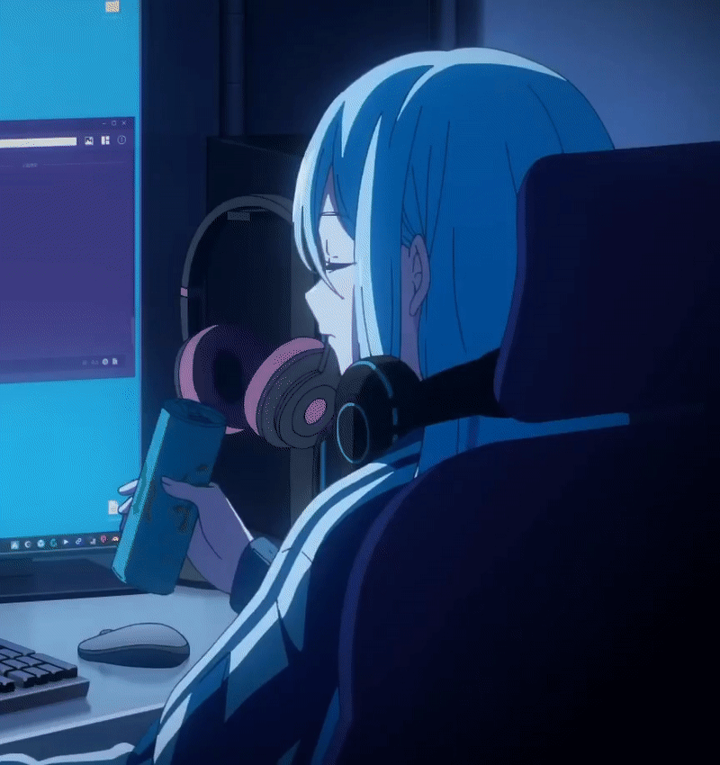

<!-- Animated Header -->

<!-- Profile Views & Social Badges -->

  
  

<!-- Quick Links -->

  
  
  
  
  

---

## 🙋‍♂️ About Me

  
  

    
I'm <strong>Thanh Trieu</strong>, also known as <strong>Konnn</strong>, a passionate Fullstack Developer with experience developing web applications using Nodejs (Express, NestJS), Python (Django), and React. I am keen on learning new technologies and improving my skills day by day. Currently, I am focused on building scalable and efficient web applications.

  

📖 More about me

- 🔭 Currently, I'm 3rd-year Student at HCMCOU, majoring in Information Technology.
- 🌱 I'm currently learning **React/Next.js, Django, and DevOps**
- 👯 I'm looking to collaborate on **open source projects**
- 🎯 2026 Goals: **Contribute to more open source projects and master cloud technologies**

---

## 🛠️ Languages & Technologies

  
  
  
  
  
  
  
  
  
  

## 📊 GitHub Analytics

   

  

## Recent Projects

- [Online Exam Monitoring System](https://github.com/konnn04/online-exam-monitoring-system.git): A desktop application for monitoring online exams.
- [Devtab](https://github.com/Riikon-Team/DevTab): A extension for browser, customizing new tab page.
- [Rent House App](https://github.com/konnn04/rent-house-app.git): A mobile application for renting houses.
- [EngTalk](https://github.com/konnn04/engtalk-ai-system): A system for language learning and practice, using AI to assist users.
- [RiikonBot](https://github.com/konnn04/RiikonBot): A Discord bot for managing server activities and providing useful utilities.

<!-- ## 📈 Contribution Graph

  

--- -->

## 🐍 Contribution Snake

  <picture>
    <source media="(prefers-color-scheme: dark)" srcset="https://raw.githubusercontent.com/konnn04/konnn04/output/github-contribution-grid-snake-dark.svg">
    <source media="(prefers-color-scheme: light)" srcset="https://raw.githubusercontent.com/konnn04/konnn04/output/github-contribution-grid-snake.svg">
    
  </picture>

---

## 🤝 Connect With Me

  

  
  
  

<!-- ### 💭 Random Dev Quote

 -->

---

<!-- 

**Thanks for visiting my profile! 😊**

_Let's connect and build something amazing together!_ 🚀

 -->
