<!-- Profile Views & Social Badges -->

  
  

<h1>👋 Hi guy! I'm Trieu Thanh Nguyen!</h1>
<b><i>Fullstack Developer</i></b>

  
  

    

      A few years of experience building websites for clients, automated bot systems, and tools with over 500 users.
    

  

## 🛠️ Languages & Technologies

  <strong>Language:</strong> 
  
  
  
  

  <strong>FE:</strong> 
  
  
  
  
  

  <strong>BE:</strong> 
  
  
  
  

  <strong>Database & Infra:</strong> 
  
  
  
  

## 📊 Stats

## Projects

- **[Foxy Exam](https://github.com/konnn04/foxy-exam)** — Online exam platform with AI proctoring: WebRTC camera/screen streaming, violation detection, evidence recording, microservices architecture *(graduation thesis 2026)*
- **[Discord Bot](https://github.com/mpc-ou/discord-bot)** — Modular Discord bot built with NestJS + React/Vite dashboard; supports music, moderation, XP system, and meeting scheduling
- **[MPC Extension](https://github.com/mpc-ou/mpc-extension)** — Browser extension for OU students: GPA calculator, study planner, schedule tools — 500+ users, published on Chrome Web Store
- **[QiQi Studio](https://github.com/konnn04/qiqi-studio)** *(private)* — Web app for a photography studio built with Next.js + NestJS; includes photo album management and a landing page
- **[MPC Web](https://github.com/konnn04/mpc-web)** — Club landing page with member info management and post features

<!-- ## 📈 Contribution Graph

  

--- -->

## 🐍 Contribution

  <picture>
    <source media="(prefers-color-scheme: dark)" srcset="https://raw.githubusercontent.com/konnn04/konnn04/output/github-contribution-grid-snake-dark.svg">
    <source media="(prefers-color-scheme: light)" srcset="https://raw.githubusercontent.com/konnn04/konnn04/output/github-contribution-grid-snake.svg">
    
  </picture>

---

## 🤝 Connect

  
  
  
  

<!-- ### 💭 Random Dev Quote

 -->

---

<!-- 

**Thanks for visiting my profile! 😊**

_Let's connect and build something amazing together!_ 🚀

 -->
